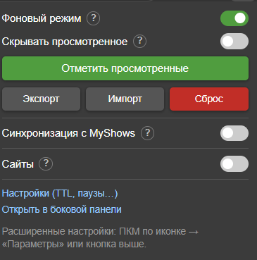
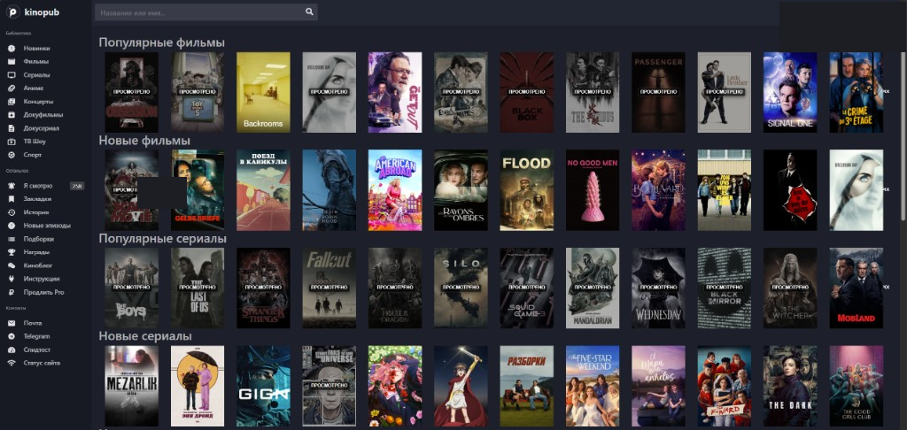
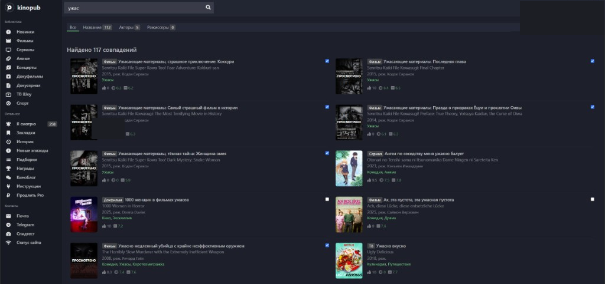
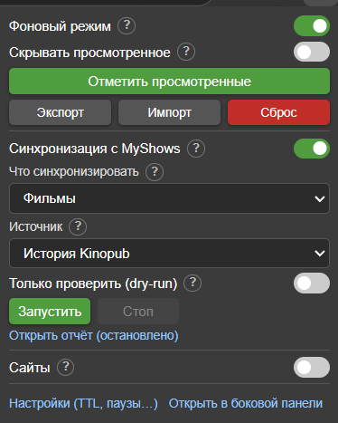
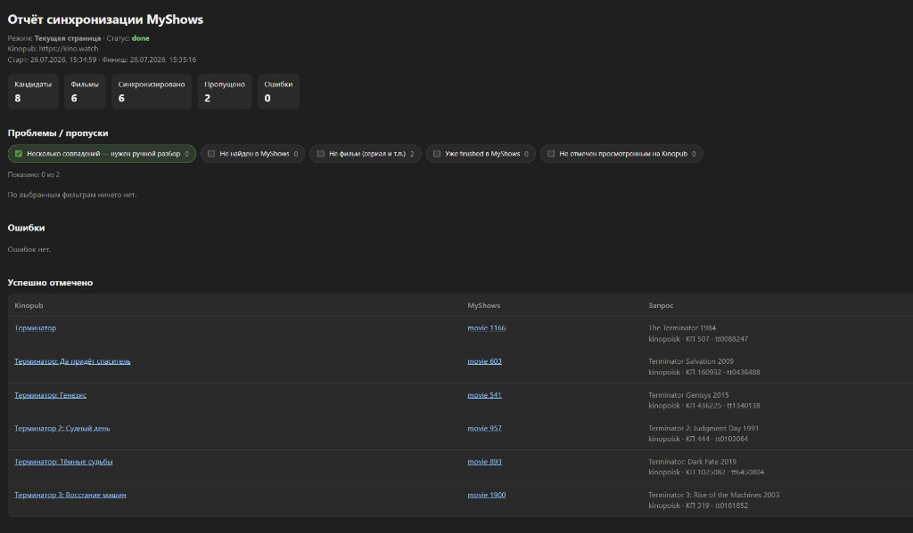
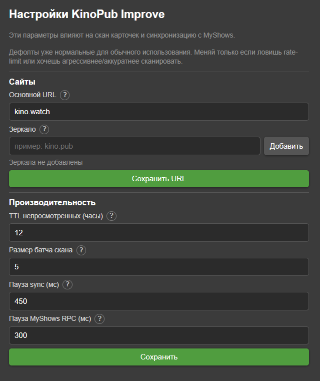

# KinoPub Improve

Chrome-расширение (Manifest V3): отмечает просмотренные материалы на [Kinopub](https://kino.watch) / зеркалах и синхронизирует фильмы в [MyShows](https://myshows.me).

> Неофициальный проект, не связан с Kinopub и MyShows.  
> Версия: **0.0.1.0** · лицензия [MIT](LICENSE)

## Возможности

- Затемнение / скрытие просмотренных карточек в списках и поиске
- Кэш просмотренных / непросмотренных + экспорт / импорт / сброс
- Основной URL и зеркала (optional host permissions)
- Синхронизация фильмов Kinopub → MyShows (`finished`)
- Матчинг по названию / году и проверка Kinopoisk / IMDb ID
- Dry-run, отмена, checkpoint / resume после убийства service worker
- Ручной выбор кандидата при неоднозначном матче (`ambiguous`)
- Страница параметров (TTL, паузы) и боковая панель Chrome
- Badge на иконке: зелёный — скан, синий — sync

## Скриншоты

| Popup | Список | Поиск |
|:-----:|:------:|:-----:|
|  |  |  |

| MyShows sync | Отчёт | Параметры |
|:------------:|:-----:|:---------:|
|  |  |  |

## Установка

### Из исходников (разработка)

1. Клонируй репозиторий
2. Открой `chrome://extensions`
3. Включи **Режим разработчика**
4. **Загрузить распакованное расширение** → выбери папку проекта
5. Открой `kino.watch` (или зеркало) и войди в аккаунт
6. Для sync открой `myshows.me` и войди там тоже

### Из zip-релиза

1. Скачай `kino-pub-improve-*.zip` из [Releases](../../releases)
2. Распакуй в любую папку
3. Загрузи эту папку как распакованное расширение (шаги выше)

## Использование

1. Включи **Фоновый режим** — скан списков идёт сам
2. При необходимости настрой **Сайты** (основной URL / зеркала)
3. Для переноса в MyShows открой блок sync → выбери источник → лучше сначала **dry-run** → смотри отчёт
4. Расширенные паузы и TTL — в **Параметры** (ПКМ по иконке или ссылка в popup)

## Сборка и тесты

```bash
npm install
npm test
npm run typecheck
npm run pack
```

Архив: `dist/kino-pub-improve-<version>.zip`.

## Структура

```
background.js          # service worker
content-scripts/       # скан карточек + CSS «ПРОСМОТРЕНО»
lib/hosts.js           # хосты, runtime-настройки
lib/match-utils.js     # парсинг / матчинг (покрыт тестами)
lib/myshows-sync.js    # синхронизация с MyShows
popup/                 # компактный popup
options/               # параметры
sidepanel/             # боковая панель
report/                # отчёт sync
test/                  # unit-тесты
```

## План развития

Смотри [`docs/ROADMAP.md`](docs/ROADMAP.md) — сериалы, Store, матчинг, CI и т.д.

## Ограничения

- Сериалы в sync пока в разработке (в UI отключены)
- Sync фильмов опирается на сессию cookies MyShows и доступ к Kinopub
- Origin для sync: текущая вкладка Kinopub / зеркало, иначе основной URL из настроек

## Privacy

Расширение работает локально в браузере:

- не отправляет данные на сторонние серверы автора
- ходит только на настроенные хосты Kinopub и `myshows.me`
- кэш и отчёты хранятся в `chrome.storage`

## Contributing

Issues и PR приветствуются. Перед PR: `npm test` и `npm run typecheck`.
